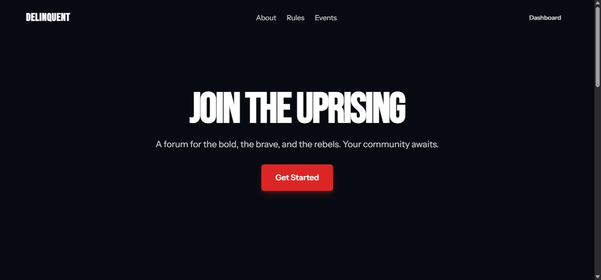

# delinquent.id



A modern, interactive forum platform built with the TALL stack (Tailwind, Alpine, Livewire, Laravel), designed for engaging discussions and a vibrant community interaction.

## ✨ Features

-   **Article Management:** Create, view, and manage articles with rich text content, images, categories, and tags through the Filament admin panel.
-   **Modern UI/UX:** A clean, responsive, and intuitive design built with Tailwind CSS and Alpine.js.
-   **Dynamic Components:** Seamless user experience with real-time updates powered by Livewire.
-   **Thread & Comment System:** Create, view, and engage in discussions with nested replies.
-   **Refactored Voting System:** Efficiently upvote/downvote threads and comments to highlight valuable content.
-   **Role-Based Access Control (RBAC):** Clear separation of permissions between 'admin' and 'member' roles using `spatie/laravel-permission`.
-   **Soft Deletes:** Threads and comments are soft-deleted to maintain data integrity.
-   **Category Organization:** Browse threads by categories for easy navigation.
-   **Admin Panel (Filament):** A powerful and intuitive admin panel to manage users, threads, categories, and more.
-   **Idempotent Seeders:** Database seeders are designed to be run multiple multiple times without creating duplicate data.

## 🚀 Technologies Used

-   **Laravel 11.x:** The PHP Framework for Web Artisans.
-   **Livewire 3.x:** A full-stack framework for Laravel that makes building dynamic interfaces simple.
-   **Tailwind CSS:** A utility-first CSS framework for rapidly building custom designs.
-   **Alpine.js:** A rugged, minimal JavaScript framework for composing behavior directly in your markup.
-   **MySQL:** Robust and reliable database management.
-   **Filament 3.x:** A collection of tools for rapidly building beautiful TALL stack apps.
-   **Spatie Laravel Permission:** For robust role and permission management.
-   **Spatie Laravel Tags:** For adding and managing tags on models.

## 📦 Installation

Follow these steps to get the project up and running on your local machine.

### Prerequisites

-   PHP >= 8.2
-   Composer
-   Node.js & npm (or Yarn)
-   MySQL (or another database supported by Laravel)

### Steps

1.  **Clone the repository:**

    ```bash
    git clone https://github.com/your-username/delinquent-id.git
    cd delinquent-id
    ```

2.  **Install PHP dependencies:**

    ```bash
    composer install
    ```

3.  **Install Node.js dependencies:**

    ```bash
    npm install
    ```

4.  **Copy the environment file:**

    ```bash
    cp .env.example .env
    ```

5.  **Generate application key:**

    ```bash
    php artisan key:generate
    ```

6.  **Configure your database:**
    Open the `.env` file and update the database credentials:

    ```dotenv
    DB_CONNECTION=mysql
    DB_HOST=127.0.0.1
    DB_PORT=3306
    DB_DATABASE=delinquent_id
    DB_USERNAME=root
    DB_PASSWORD=gualupa420
    ```

7.  **Run database migrations and seeders:**

    ```bash
    php artisan migrate --seed
    ```

    This command will set up the database schema and populate it with initial data, including roles, permissions, and a default admin user. The seeders are idempotent, meaning you can run this command again without causing errors or data duplication.

8.  **Link storage:**

    ```bash
    php artisan storage:link
    ```

9.  **Compile assets:**

    ```bash
    npm run dev
    ```

    For production, use `npm run build`.

10. **Start the development server:**

    ```bash
    php artisan serve
    ```

    The application will be available at `http://127.0.0.1:8000`.

## 💡 Default Users

The database seeder creates the following users for testing and administration:

-   **Admin:**
    -   **Email:** `admin@example.com`
    -   **Password:** `admin123`
-   **Test User:**
    -   **Email:** `test@example.com`
    -   **Password:** `password`

You can access the Filament admin panel at `/admin` using the admin credentials.

## 🤝 Contributing

Contributions are welcome! Please feel free to submit a pull request.

1.  Fork the Project
2.  Create your Feature Branch (`git checkout -b feature/AmazingFeature`)
3.  Commit your Changes (`git commit -m 'Add some AmazingFeature'`)
4.  Push to the Branch (`git push origin feature/AmazingFeature`)
5.  Open a Pull Request

## 📄 License

This project is open-sourced software licensed under the [MIT license](https://opensource.org/licenses/MIT).
